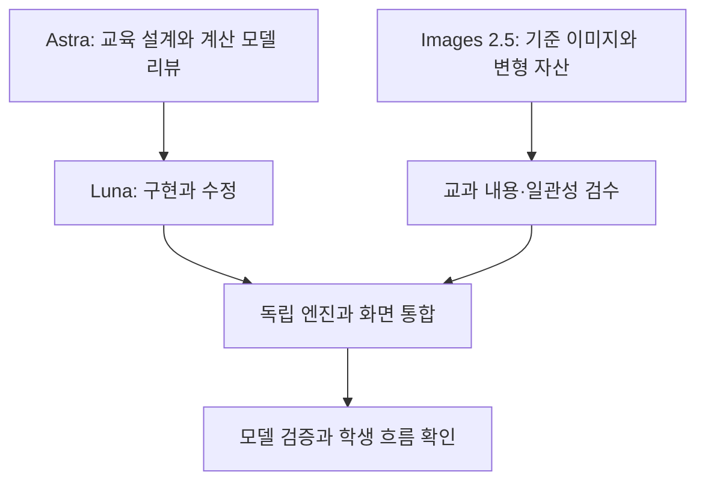

# 12종 교육용 웹앱 공통 설계 기준

> 작성일: 2026-09-10 · 상태: 제작 전 설계 초안 v0.1  
> [전체 목록](README.md)

## 1. 학습과 콘텐츠

- 학습 목표를 관찰 가능한 행동으로 적습니다. '이해한다'만 쓰지 않고 예측, 비교, 근거 선택, 설명 수정으로 성취를 확인합니다.
- 첫 오답은 학습의 출발점입니다. 조건 되돌리기, 원인 단서, 재시도, 새로운 조건에 적용하는 과제를 제공합니다.
- 기록은 현재 세션에서 수행한 실험과 근거를 비교하기 위한 용도입니다. 계정, 영구 저장, 경쟁 점수, 자동 AI 채점은 기본 범위가 아닙니다.
- 역사·문학의 복수 해석과 과학 모델의 불확실성을 한 개의 점수로 축약하지 않습니다.
- 권장 학년과 선수 개념을 적되, 공식 교육과정 성취기준 번호는 원문 확인 전 임의로 부여하지 않습니다.
- 교사가 활용할 수 있는 한 차시 흐름, 예시 질문, 관찰할 성취 증거를 개별 문서에 포함합니다.

## 2. 제작 단계에서의 AI 역할

- Astra: 학습 목표, 복잡한 알고리즘의 선택, 수식·자료·오개념 검토, 결과 리뷰.
- Luna: 모듈 구현, 콘텐츠 연결, 테스트, 버그 수정, 승인된 범위의 릴리스 작업.
- Images 2.5: 제작 시점의 교육 이미지 생성과 편집. 실시간 상태 계산, 정답 생성, 측정값 생성에 사용하지 않습니다.
- 이미지 생성 도구에서 원하는 모델이 실제 선택 가능한지 확인한 뒤 제작합니다. 호출 도구가 세부 모델을 노출하지 않으면 모델 사용을 확인했다고 주장하지 않습니다.

## 3. 시뮬레이션과 근거 모델

- 상태, 입력, 단위, 시간 간격, 경계 조건, 출력과 오류 상태를 명시합니다.
- 보존해야 하는 양이 있는 경우 수지식과 수치 오차 판정 기준을 정합니다. 시간 간격과 렌더링 프레임을 분리합니다.
- 난수 모델에는 시드·반복 횟수·표본 크기를 기록하고, 한 번의 결과를 일반 법칙처럼 표현하지 않습니다.
- 단순화는 학생에게 필요한 위치에서 짧게 표시합니다. 렌더링 효과와 실제 계산을 구분합니다.
- 모델 유효 범위를 벗어난 입력을 조용히 보정하지 않습니다. 이유를 표시하고 수정할 수 있게 합니다.
- 문학·역사는 원문/사료, 재구성, 편집본, 학습자의 해석을 서로 연결하는 데이터 구조를 설계합니다.
- 개별 문서의 수치 허용오차·성능 목표는 제안값이며, 프로토타입에서 타당성을 확인한 후 확정합니다.

## 4. 이미지 제작 기준

| 필드 | 용도 |
|---|---|
| assetId / scenarioId | 이미지와 과제의 안정적인 연결 |
| role | 맥락, 비교, 증거 재구성, 장식 등 학습상 역할 |
| referenceAssetId | 기준 이미지와 변형 관계 |
| invariant / variant | 유지해야 할 요소와 변경할 요소 |
| sourceIds | 근거 사료·과학 자료의 ID |
| promptVersion / generator | 제작 조건과 확인된 모델 또는 도구 |
| reviewStatus / reviewNotes | 교과·시각 일관성 검수 상태 |
| alt / caption | 텍스트 대안과 재구성 표기 |
| dimensions / format / bytes | 화면 비율과 전송량 관리 |

- 텍스트·수식·축·정밀 도형·결합 구조는 가능한 한 HTML/SVG/계산 기하로 표현합니다.
- 이미지 비교에서 한 조건만 바뀌어야 하는 경우 기준 이미지를 편집하고 모든 불변 요소를 검수합니다. 정확한 크롭·순서 변경은 코드로 처리할 수 있습니다.
- 생성 이미지의 픽셀을 사실 측정 데이터로 해석하지 않습니다. 과제의 근거로 쓰는 특징은 검수된 콘텐츠 메타데이터와 일치해야 합니다.
- 콘텐츠 자산 수량은 초안 제작량입니다. 모든 이미지를 처음 화면에 내려받지 않고 단계별로 지연 로드합니다.
- 최종 화면용 WebP/AVIF 등은 브라우저 지원과 품질 확인 후 선택합니다. 원본은 웹 배포 자산과 분리합니다.
- 역사 재구성, 가상 사건, 개념 모형은 그 성격을 캡션으로 표시합니다.

## 5. 화면과 상호작용

- 데스크톱은 탐구 화면과 조작·근거 영역을 나란히 배치하고, 좁은 화면에서는 현재 수행할 활동을 우선하여 세로로 재배치합니다.
- 3D 회전과 드래그 외에 선택 후 이동, 수치 입력, 단계 버튼, 시점 프리셋을 제공합니다.
- 회전·자동 재생은 학습상 필요가 있을 때만 사용합니다. 기본 자동 회전은 끕니다.
- 색상만으로 결과를 구분하지 않고 기호·라벨·패턴·표를 함께 사용합니다.
- 현재 단계의 필수 버튼 하나에만 gi-pulse 계열 강조를 적용합니다. 모션 감소에서는 애니메이션을 정적 강조로 바꿉니다.
- '업데이트 내역' 버튼은 학습 활동을 가리지 않는 상단 또는 하단에 작게 둡니다. 실제 개발일, 개선일, 간단한 변경 내용을 표시합니다.
- 밝은 테마를 유지하며 OS의 어두운 테마로 자동 전환하지 않습니다.
- VoiceOver 구현 및 검증은 제외합니다. 키보드, 초점, 확대, 대비, 텍스트 대안, 모션 감소는 일반적인 사용성 검증에 포함합니다.

## 6. 기술 구조 제안

첫 버전은 React + TypeScript + Vite와 Three.js를 사용하는 정적 웹앱을 우선 검토합니다. 이는 버전이나 라이브러리 선택을 확정한 것이 아니며, 기존 프로젝트에서 구현할 경우 현재 구조와 호환성을 먼저 확인합니다.

| 경계 | 책임 |
|---|---|
| domain | 상태, 단위, 엔티티, 허용 입력 |
| engine | 계산·기하·콘텐츠 관계와 검증 규칙 |
| scenarios | 과제, 기준값, 시드, 출처와 힌트 |
| renderers | Three.js 및 2D 시각화, 엔진 결과 표시 |
| components | 조작판, 근거 선택, 비교와 업데이트 내역 |
| assets | 검수된 이미지 목록과 지연 로딩 |

- 엔진은 렌더링 라이브러리와 독립적으로 검증할 수 있어야 합니다.
- 계산 부하가 큰 경우 Web Worker를 검토합니다. 모든 앱에 일괄 적용하지 않습니다.
- 코드 한 파일이 500줄 이상이면 기능별로 분리합니다. 거대한 컴포넌트·시나리오 파일을 만들지 않습니다.
- WebGL 사용이 어려운 환경에서는 고정 시점·단면·표 등으로 학습 핵심을 이어가도록 대체 화면을 설계합니다.
- 지속 저장·파일 업로드·외부 AI 호출을 추가하려면 학습 필요와 사용자 요청을 먼저 확인합니다.

## 7. 검증 단계

1. 모델 검증: 알려진 해석해·작은 기준 사례·보존 관계·경계 입력 또는 사료/원문 정합성으로 확인합니다.
2. 통합 검증: 조건을 바꾸면 계산·화면·비교 기록·설명이 함께 갱신되는지 확인합니다.
3. 학생 흐름: 예측, 첫 실행, 예상과 다른 결과, 수정, 재실행, 설명까지 실제로 수행합니다.
4. 반응형·키보드: 360px와 1280px를 기본 제안 폭으로 하고 320px에서도 핵심 조작의 가로 넘침을 확인합니다. 전환 후 다음 필수 행동이 보이는지 확인합니다.
5. 오류 복구: 이미지 로딩 실패, 잘못된 입력, 계산 중 취소, WebGL 미지원 시의 복구를 확인합니다.
6. 교과 리뷰: 과학 모델·사료·문학 해석을 검토하고, 소규모 학생 사용으로 오개념과 혼동을 확인합니다.

문서 작성 단계에서는 위 검증이 통과했다고 표시하지 않습니다. 구현 후 측정 기기와 조건을 기록하고, 로컬 통과·공개 배포 확인·교실 수용성을 구분합니다.

## 8. 착수·배포 경계

- 12개 문서는 선택과 후속 기획을 위한 초안이며 12개 앱의 동시 구현을 승인하는 문서가 아닙니다.
- 앱별 저장소·배포 환경·실제 콘텐츠·교과 검수자를 착수 단계에서 결정합니다.
- 배포 후 보고에는 클릭 가능한 실제 앱 주소와 확인한 범위를 포함합니다. 미배포 상태에서 추정 URL을 만들지 않습니다.
- HVC 등록과 정적 갤러리 동기화는 서로 다른 작업이며 별도 요청 범위로 취급합니다.

## 9. 변경 이력

| 날짜 | 버전 | 내용 |
|---|---|---|
| 2026-09-10 | 0.1 | 12종 설계 문서의 공통 학습·모델·이미지·사용성·검증 기준 작성 |
