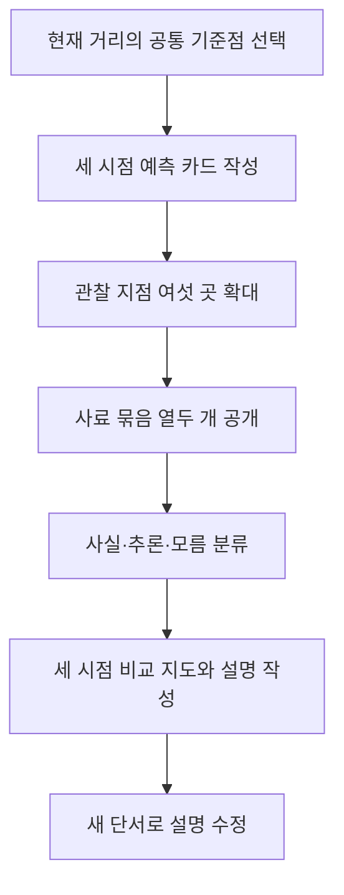

# 09. 한 거리의 300년

> 작성일: 2026-09-10 · 상태: 제작 전 설계 초안 v0.1
> 이 문서는 앱 구현, 이미지 생성, 커밋, 푸시, 배포를 승인하지 않습니다.
> 서울 종로 권역은 사료 접근성이 높은 후보일 뿐이며, 특정 실제 거리와 복원 구간은 추가 사료 검토 후 확정합니다.

> [전체 목록](README.md) · [공통 설계 기준](00-shared-design-principles.md)

## 1. 제품 목표

1. 학생이 같은 거리의 서로 다른 시점에서 보이는 것을 관찰한다.
2. 관찰한 세부를 사료의 문장·지도·사진·유물 기록과 연결한다.
3. 사료가 직접 말하는 사실, 재구성에 필요한 추론, 아직 모르는 것을 구분한다.
4. 한 시대의 모습이 다음 시대에 어떻게 바뀌었는지 근거를 붙여 설명한다.
5. 생성된 역사 이미지를 실제 사료 사진과 혼동하지 않고 캡션을 읽는다.

권장 제품 문장: “한 장소를 오래 바라보며, 자료가 말하는 만큼만 과거를 그려 보자.”

## 2. 대상과 선수 개념

- 권장 대상: 초등 고학년, 중학교 역사·사회, 고등학교 역사 탐구 입문.
- 한 차시: 45~50분, 2인 1조 또는 개인 사용.
- 선수 개념: 연대기, 지도 기호, 사진의 촬영 시점, 1차·2차 사료의 차이.
- 있으면 좋은 개념: 도시 공간, 상업, 교통, 행정 변화, 증거와 해석.
- 공식 교육과정 성취기준 번호는 원문 대조 전까지 부여하지 않는다.

## 3. 목표 오개념과 교정 단서

| 예상 오개념 | 화면 단서와 교정 활동 |
|---|---|
| 옛날 거리는 한 시기에 멈춰 있었다 | 같은 관찰 지점의 세 시점을 나란히 비교하게 한다 |
| 생성된 그림은 당시 사진이다 | 모든 재구성에는 “사료 기반 시각 재구성” 라벨을 붙인다 |
| 한 지도에 있는 건물은 사진처럼 정확하다 | 지도·기록·후대 해설의 정보 범위를 각각 표시한다 |
| 사료에 없는 내용도 사실로 채울 수 있다 | “근거 있음/추론/모름” 중 하나를 선택해야 한다 |
| 변화는 기술 하나가 원인이다 | 상업·교통·정책 등 여러 사료 묶음을 연결한다 |

## 4. 300년의 시점 가정

이름의 300년은 세 시점 사이의 전체 간격을 300년으로 둔다는 뜻이다.

- 시점 A: 1725년 전후, 후기 조선의 종로 상업 공간을 탐색하는 가설 시점.
- 시점 B: 1875년 전후, 개항 직전·직후 변화가 교차하는 가설 시점.
- 시점 C: 2025년 전후, 현재 도시 경관을 관찰하는 시점.
- A→B와 B→C는 각각 150년 간격이라는 제작 가정이다.
- 1725년과 1875년의 정확한 거리 모습은 선택한 구간의 자료가 확인된 뒤 수정한다.
- 연도는 사건을 대표하는 고정점이며, 그 해의 하루를 복원한다는 뜻이 아니다.

## 5. 장소 후보와 사료 검토 상태

1. 1차 후보: 서울 종로1가~3가의 일부 보행 가능 구간.
2. 후보 이유: 서울역사박물관이 종로 시전행랑 유구, 종로의 개화기 가로 경관, 공평동 골목길 자료를 제공한다.
3. 후보 구간은 행정상 도로명·지번·시점별 자료가 겹치는 최소 구간으로 다시 좁힌다.
4. 현재 문서는 “종로라는 권역으로 시험할 수 있다”는 설계 가설이다.
5. 특정 상점·집·간판을 1725년 모습으로 확정해서 그리지 않는다.
6. 고증 검토자는 서울사·도시사 연구자 또는 박물관 학예 검토자를 착수 조건으로 둔다.

## 6. 한 차시 흐름



## 7. 관찰 지점 여섯 곳

| ID | 관찰 지점 | 학생 질문 |
|---|---|---|
| P01 | 큰길의 폭과 가장자리 | 이동과 장사를 위해 어떤 공간이 필요한가? |
| P02 | 가게 앞 진열·행랑 | 무엇을 직접 볼 수 있고 무엇을 추론하는가? |
| P03 | 교통 표지와 이동 수단 | 속도·방향·소음은 어떻게 달라지는가? |
| P04 | 공공 건물·공원·전신 시설 | 공공 공간의 역할이 어떻게 보이는가? |
| P05 | 사람들의 복장·행동 | 한 장면만으로 사회 전체를 말할 수 있는가? |
| P06 | 땅·배수·골목 연결 | 지도와 현장 시선이 일치하지 않는 부분은 무엇인가? |

## 8. 사료 묶음 12개 초안

각 묶음은 한 장의 이미지가 아니라 출처, 날짜, 매체, 범위 메모를 가진 자료 단위다.

| ID | 후보 자료 묶음 | 상태 |
|---|---|---|
| S01 | 18세기 한성 도성·도로 지도 발췌 | 원본 판본과 축척 확인 필요 |
| S02 | 시전·행랑 관련 조선시대 기록 발췌 | 원문 번역·인용 범위 확인 필요 |
| S03 | 종로 상업·가격·상품 기록 발췌 | 장소 직접 연결 여부 확인 필요 |
| S04 | 발굴된 종로 시전행랑 유구 도면 | 박물관 설명과 원도면 대조 필요 |
| S05 | 19세기 서울 도로·성문 지도 | 지도 제작일과 재인쇄 구분 필요 |
| S06 | 1870년대 개항·도시 행정 기록 | 종로 구간 언급 여부 확인 필요 |
| S07 | 1896년 종로 가로 정비 기록 | 1875 가정과 시점 차이 표시 |
| S08 | 1898년 종로 전차 선로 기록 | 1875 시점 화면에 섞지 않음 |
| S09 | 20세기 초 종로 사진·엽서 | 촬영 위치·방향·저작권 확인 필요 |
| S10 | 근현대 상점·시장 생활 자료 | 개인·상호 정보의 공개 범위 확인 필요 |
| S11 | 현재 도로 지도·공공 거리뷰 | 촬영일·라이선스 확인 필요 |
| S12 | 공평동 발굴 골목길·생활유물 기록 | 다른 구간의 사례임을 명시 |

S04와 S12는 선택 후보와 관련된 근거이지, 동일 거리 복원의 확정 증거가 아니다.

## 9. 최소 구체 과제

### 과제 A: 먼저 보이는 것만 말하기

- 입력: 세 시점의 기준 장면, 여섯 관찰 지점 썸네일.
- 조작: 지점을 선택하고 “보이는 사실” 문장 카드를 끌어 놓는다.
- 판정: 픽셀의 색을 맞히는 것이 아니라 검수된 장면 메타데이터와 일치하면 통과.
- 오답: 해당 세부가 화면에 없으면 확대와 “다시 보기” 단서를 준다.

### 과제 B: 사료와 장면 연결하기

- 입력: 사료 묶음 12개 중 현재 단계의 4~6개.
- 조작: 사료 카드를 관찰 지점과 연결하고 직접 근거·간접 근거 태그를 선택한다.
- 판정: 정답 하나만 강요하지 않고, 연결 이유와 자료의 날짜가 맞는지 확인한다.
- 피드백: 자료의 시점이 장면 시점과 다르면 “참고 사례”로 이동시킨다.

### 과제 C: 300년 변화 설명

- 입력: 세 시점 비교 화면과 학생의 변화 화살표.
- 조작: 원인 카드 두 장, 결과 카드 한 장, 불확실성 카드 한 장을 선택한다.
- 판정: 선택한 원인에 연결된 사료 ID가 하나 이상이고, 시대가 뒤섞이지 않으면 성취.
- 재시도: 1898년 전차 기록을 1875년 장면에 붙이면 시간축 경고를 보여준다.

### 과제 D: 복원 범위 경계선 그리기

- 입력: 후보 지도와 자료가 확인된 공간 범위.
- 조작: 학생이 “자료로 말할 수 있는 영역”과 “추가 조사가 필요한 영역”을 색칠한다.
- 판정: 자료가 없는 건물까지 확정하지 않으면 통과한다.

## 10. 화면과 조작

- 상단에는 시점 탭, 현재 과제, 작은 업데이트 내역 버튼을 둔다.
- 왼쪽은 장면 또는 지도, 오른쪽은 사료·분류·설명 패널이다.
- 360px 이하에서는 장면→사료→답안 순으로 세로 배치한다.
- 기준점 프리셋은 북쪽 보기, 큰길 보기, 관찰 지점 보기 세 가지를 제공한다.
- 이미지 확대는 코드의 동일 프레임 crop으로 처리한다.
- 시점 전환은 자동 회전 없이 학생의 탭으로 실행한다.
- 현재 필수 행동 버튼 하나에만 gi-pulse 아우라를 적용한다.
- `prefers-reduced-motion`에서는 gi-pulse를 정적 테두리로 바꾼다.
- 색상 외에 A/B/C 라벨과 아이콘으로 시점을 구분한다.

## 11. 입력·상태·출력·근거 모델

```text
SessionState = {
  selectedEra: 1725 | 1875 | 2025,
  selectedPoint: P01..P06,
  evidenceLinks: EvidenceLink[],
  claims: Claim[],
  completedTasks: string[],
  revisionCount: number
}
Claim = { text, claimCardId?, type: observation | historicalFact | inference | unknown, era, pointId, sourceIds[] }
```

- `observation`: 생성 이미지나 사진에서 보이는 시각 정보이며 역사 사실로 승격하지 않는다.
- `historicalFact`: 검수된 사료가 직접 확인하는 범위이며 생성 이미지 metadata만으로 만들지 않는다.
- `inference`: 하나 이상의 관찰·사료를 이어 만든 해석.
- `unknown`: 자료가 부족해 결론을 보류한 상태.
- 판정 엔진은 sourceIds의 날짜·장소 범위와 claim의 시대·지점을 비교한다.
- 판정 엔진은 구조화된 카드 ID·날짜·범위·근거 링크만 확인하며 자유 서술의 내용은 자동 평가하지 않는다.
- 콘텐츠 근거 모델은 `sourceId`, `sourceType`, `date`, `placeScope`, `quoteOrNote`, `rights`, `reviewStatus`를 가진다.
- 이미지 파일 자체는 사실 데이터가 아니며 `assetId`와 검수 메모만 근거 그래프에 연결한다.

## 12. 3D 역할과 범위

- 3D는 건물 높이·공간의 상대 위치를 살펴보는 선택적 거리 모형으로만 사용한다.
- 보행 시뮬레이션, 인구 수치, 상점 수, 교통량을 3D에서 추정하지 않는다.
- 첫 MVP는 2D 지도와 기준 시점 이미지로 핵심 활동을 완성한다.
- 3D를 넣을 경우 동일한 좌표 기준점과 방향 표시를 제공한다.
- WebGL 미지원 시 정적 평면도와 여섯 관찰 카드로 학습 흐름을 유지한다.

## 13. Images 2.5 자산 계획

| 자산 종류 | 수량 초안 | 기준 | 변형 |
|---|---:|---|---|
| 생성 원본 기준 장면 | 9 | 3시점×3 관찰 묶음 | 시선 방향 2종 |
| 코드 crop 관찰 확대 | 18 | 6지점×3시점, 원본 포함 | 원경·근경 좌표 |
| 실제 사료 카드 | 12 | S01~S12, 이미지·문서 원본 별도 | 지도·유물·문서 비율 |
| 현재 기준 사진 | 3 | 장소 확정 후 촬영·라이선스 확인 | 낮·비 오는 날 |
| 안내·상태 아이콘 | 8 | 사실·추론·모름 등 | 색상 대비 변형 |

### 기준 프롬프트 1

“교육용 역사 재구성 이미지, 서울 종로 후보 거리의 넓은 시야, [시점]의 도시 재료와 교통을 검수된 사료 메모에 맞춰 표현, 특정 인물·상호·문자를 임의로 만들지 않음, 실제 사진처럼 보이되 화면 하단에 재구성 라벨을 넣을 공간, 밝은 낮, 정면 비교 가능한 카메라 높이, 텍스트와 수식 없음.”

### 기준 프롬프트 2

“같은 시점의 근접 변형은 카메라 위치·도로 축·기준점만 유지하고, 시대 변형에서는 건물과 교통을 사료에 따라 바꾼다, [관찰 지점]만 근접, 미확인 세부는 중립적으로 처리, 역사 사진이나 실제 기록으로 오인되지 않는 캡션 공간, 밝은 테마.”

생성 전에는 `generator`가 실제 Images 2.5인지 확인하고, 확인되지 않으면 도구명을 확정해 기록하지 않는다.

## 14. 검수와 피드백

- 역사 검수: 연대·장소·교통·건축 요소별 근거 ID를 대조한다.
- 시각 검수: 기준 이미지와 변형 이미지의 불변 항목을 체크리스트로 비교한다.
- 모든 재구성에는 “사료에 직접 찍힌 사진 아님” 캡션을 표시한다.
- 사실 카드를 틀리게 놓으면 해당 사료의 날짜와 범위를 먼저 보여준다.
- 추론이 가능한 경우는 정답/오답 대신 연결된 관찰과 빠진 근거를 피드백한다.
- 성취 증거는 여섯 지점 관찰 4개 이상, 근거 연결 3개 이상, 수정 설명 1개다.
- 교사는 학생의 주장·sourceIds·수정 전후를 세션 내보내기 없이 화면에서 확인한다.

## 15. 모듈 데이터 구조

```ts
type Era = { id: string; yearLabel: string; displayLabel: string; sourceIds: string[] }
type Point = { id: string; label: string; anchor: [number, number]; prompt: string }
type Source = { id: string; kind: 'map'|'record'|'photo'|'artifact'; date: string; scope: string; note: string; status: string }
type Asset = { id: string; eraId: string; pointId?: string; role: string; referenceAssetId?: string; invariant: string[]; variant: string[]; caption: string; reviewStatus: string }
type Task = { id: string; prompt: string; allowedTypes: string[]; expectedEvidence: string[]; hints: string[] }
```

콘텐츠 JSON과 엔진 코드는 분리하고, 사료 원문과 번역은 별도 필드로 보관한다.

## 16. MVP와 후속

0단계 기술 프로토타입은 종로 후보 한 구간의 실제 위치를 확정하지 않은 채 합성된 “연습 거리”와 목업 사료로 상호작용만 검증한다.

- 학습 MVP 출시 조건: 실제 거리 1곳 확정, 검수된 사료 묶음 12개 확보, 시점 3개·관찰 지점 6개·정적 비교·네 과제.
- 후속 1: 추가 사료를 확보해 같은 거리의 재구성 범위와 시점을 확장.
- 후속 2: 교사 편집용 사료 묶음과 학생 질문 저장.
- 후속 3: 검수된 3D 거리 모형과 현장 답사 모드.
- 후속 4: 다른 도시로 확장하되 동일 거리·동일 기준점 원칙 유지.

## 17. 기대 결과와 최소 검증

1. 입력 `assetId=A1725-P01`을 선택하면 출력에 `observation`만 생기고 `historicalFact`는 생성되지 않는다.
2. `S07(date=1896)`을 `era=1875`에 연결하면 시간 범위 경고가 나오고 연결이 자동 확정되지 않는다.
3. 사전 검수된 `claimCardId`를 가진 `Claim(type=historicalFact, sourceIds=[S04])`는 사료의 날짜·장소 범위와 지지 관계가 모두 맞을 때만 연결이 유효하다. 자유 문장의 역사적 진실을 자동 판정하지 않는다.
4. `assetId` 실패 시 `caption`, 사료 텍스트, 대체 평면도 출력이 남고 `sourceIds`는 유지된다.
5. `P01..P06` 중 네 지점 관찰 태그와 세 근거 링크를 저장하면 성취 증거가 갱신된다.
6. 세 시점 전환 입력에서 `selectedPoint`와 근거 패널의 `era`가 함께 갱신된다.
7. 360px·키보드 입력에서도 필수 버튼·현재 장면·분류 상태가 잘리지 않는다.

위 수치는 목표이며 완료 성능이나 교육 효과 결과가 아니다.

## 18. 위험과 미결정

- 실제 거리와 1725·1875 자료의 공간 정합성이 아직 미결정이다.
- 서로 다른 구간의 시전행랑·공평동 자료를 한 거리처럼 합치면 안 된다.
- 앱에는 런타임 AI, 계정, 영구 저장을 넣지 않는다.

## 19. 출처 링크와 확인 상태

- [서울역사박물관 도시유적보존](https://museum.seoul.go.kr/www/relic/cons/dataConssumculture/dataConssumcity.jsp?sso=ok) — 2026-09-10 열람; 종로 시전행랑 유구 설명 확인.
- [서울역사박물관 개항·대한제국기의 서울](https://museum.seoul.go.kr/www/exh/per/exhPer2th.jsp?sso=ok) — 2026-09-10 열람; 1896년 종로 가로 정비·1898년 전차 기록 확인.
- [서울역사박물관 공평동 현장박물관 보도자료](https://museum.seoul.go.kr/www/board/NR_boardView.do?bbsCd=1015&seq=20180912165823934&sso=ok) — 2026-09-10 열람; 16~17세기 골목·유물 사례 확인, 동일 구간 확정 근거로 사용하지 않음.

## 20. 공통 기준 요약

- 밝은 테마, 중요한 다음 행동 하나에 gi-pulse, 모션 감소 시 정적 강조.
- 작은 “업데이트 내역” 버튼에 실제 개발일·개선일·내용을 기록한다.
- 키보드·초점·대체 텍스트·작은 화면은 검증하되 VoiceOver 구현·검증은 제외한다.
- 파일은 500줄이 되기 전에 domain, content, renderer, components로 분리하고 상태는 현재 세션에만 둔다.

## 21. 변경 이력

| 날짜 | 버전 | 내용 |
|---|---|---|
| 2026-09-10 | 0.1 | 300년 시점 가정, 종로 후보·사료 12묶음·관찰 6곳·역사 재구성 경계 설계 |
